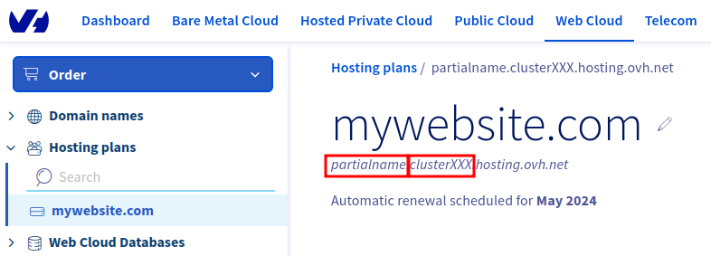

# OVH Web-hosting apache log fetcher

## Description

This tool will automatically download all daily apache logs for a simple OVH web-hosting account.

While OVH offers simple statistic tools to monitor your website, having access to raw apache logs allows for more flexibility: you can pipe them into [GoAccess](https://goaccess.io/), or in your own tooling to better understand your users.

Surprisingly, while it is possible to download individual daily logs through OVH's web interface, batch download is not an option. This simple tool fills that gap.


## Installation

You should have a working rust environment. See [here](https://www.rust-lang.org/tools/install) on how to do that.

Clone, compile and install the tool:

```bash
git clone ...
cd ovhlogs
cargo build --release
cargo install
```

## How to use

Because of how OVH stores its logs, we have multiple pieces of information to gather first.

### Getting the url details

The file URLS are built with:
- The cluster name,
- Your "partial account name" (which also seems to be the FTP username)

These are easy to identify - open up your Web hosting plan's page:



In the above screenshot, `partialname` is the url-username, and `clusterXXX` is the url-cluster.

### Creating an account dedicated to reading the logs

Moreover, the logs are protected behind a Basic HTTP auth. I'm not sure what the initial credentials are, and for all intent and purposes I would recommend creating a account dedicated to viewing these logs:

1. Locate the "Statistics and Logs" page:
   
2. At the bottom of this page, create a new account with the "Create a new user" account.
   
3. Use a new username and password: these will be the credentials you will use below.

### Usage example

Finally, create a dedicated folder for the logs, and run the tool using the credentials above. 

In the example below, we get all daily logs starting from January 1, 2022, including today's partial log file:

```bash
mkdir path/to/logs
ovhlogs --from 2022-01-01 --output path/to/logs/ --url-user partialname --url-cluster clusterXXX --user "viewer_username" --password "viewer_password"  --partial
```

Note you can use `ovhlogs --help` for more details on the options.